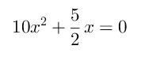
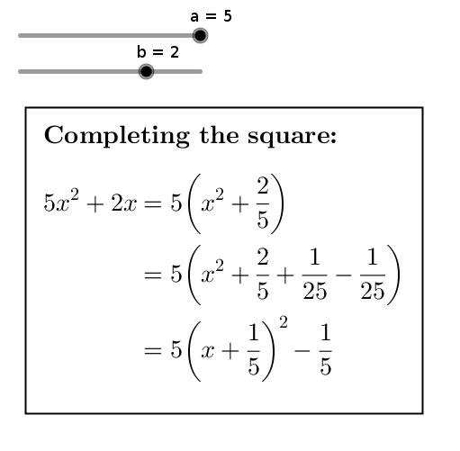

<!-- README.md is generated from README.Rmd. Please edit that file -->

[](https://lifecycle.r-lib.org/articles/stages.html#experimental)
<!-- badges: end -->

# ggtex

# Description

You can define text objects in Geogebra containing complex math in LaTeX
math mode, but the editor Geogebra offers for this is not very
convenient.

For example, you must use your mouse to open a drop-down list and select
an item everytime you want to insert the value of a Geogebra object
(i.e., a number, a formula etc.) in the text.

`ggtex` is a tiny Python script to translate from modified LaTeX math
mode to Geogebra code to define text objects.

With `ggtex`, you can use your favorite text editor to define your
Geogebra text object. In your definition, you can include Geogebra
objects delimited by the symbol `@`.

If you want to preview the contents of your text, you can use the
preview feature of your LaTeX editor, or copy your text to a full LaTeX
document and compile it to your favorite format.

When you are done defining your text, you use `ggtex` to translate it to
Geogebra code, which you must then copy and paste into the Geogebra
input bar.

For example, if you pass `ggtex` a file `example.tex` containing

``` latex
\[
  @a@ x^2 + @FractionText(b)@ x = 0
\]
```

then `ggtex` will output a file `example.tex.ggtex` with contents

``` python
FormulaText(Simplify(
a + " x^2 + " + FractionText(b) + " x = 0"
))
```

If `a` is a number defined in your Geogebra session with value, say, 10,
and `b` is a number with value, say, 2.5, then this code, when entered
in the Geogebra input bar, will produce a text object containing



`ggtex` is a command-line script. It must be run in a terminal.

# Installation

## GNU-Linux

1.  You need to have some version of [Python
    3](https://www.python.org/downloads/) installed.

2.  Download the file
    [`ggtex.py`](https://cdn.jsdelivr.net/gh/fnaufel/ggtex@latest/ggtex.py)
    and save it somewhere, preferably in `~/bin`.

3.  Make it executable (if necessary, replace `~/bin` with the directory
    where you saved the file):

        chmod a+x ~/bin/ggtex.py

4.  You need to have the [docopt
    module](https://github.com/docopt/docopt), which can be installed
    with

        pip3 install docopt

## Windows

1.  You need to have some version of [Python
    3](https://www.python.org/downloads/) installed.

2.  Download the file
    [`ggtex.py`](https://cdn.jsdelivr.net/gh/fnaufel/ggtex@latest/ggtex.py)
    and save it somewhere.

3.  You need to have the [docopt
    module](https://github.com/docopt/docopt), which can be installed
    with

        pip3 install docopt

    entered at the terminal.

# Usage

## Using `ggtex` at the Python interpreter prompt

1.  Make sure the file `ggtex.py` is in a directory in your [Python
    Module Search Path
    (PMSP)](https://realpython.com/python-modules-packages/#the-module-search-path).
    Check the contents of your PMSP by executing the following at the
    Python prompt:

        import sys
        sys.path

2.  At the Python prompt, enter

        from ggtex import ggtex

3.  To convert a file named `path/to/file.tex`, enter

        ggtex('path/to/file.tex')

4.  The translated code will be saved in file `path/to/file.tex.ggtex`.
    Open it in any text editor, copy its entire contents and paste them
    into the Geogebra input bar.

## Using `ggtex` on GNU-Linux

### Method 1

1.  Suppose you saved the `ggtex.py` file as `path/to/ggtex.py` and made
    it executable.

2.  Open a terminal running bash.

3.  To convert a file named `path/to/file.tex`, enter

        path/to/ggtex.py path/to/file.tex

    or, if `ggtex.py` was saved in a directory in your PATH, enter

        ggtex.py path/to/file.tex

4.  The translated code will be saved in file `path/to/file.tex.ggtex`.
    Open it in any text editor, copy its entire contents and paste them
    into the Geogebra input bar.

### Method 2

1.  Suppose you saved the `ggtex.py` file as `path/to/ggtex.py`.

2.  Open a terminal running bash.

3.  To convert a file named `path/to/file.tex`, enter

        python3 path/to/ggtex.py path/to/file.tex

4.  The translated code will be saved in file `path/to/file.tex.ggtex`.
    Open it in any text editor, copy its entire contents and paste them
    into the Geogebra input bar.

## Using `ggtex` on Windows

### Method 1

1.  This will work if your Windows system is configured to execute `.py`
    files by sending them to the Python 3 interpreter. If it doesn’t
    work, try method 2 below.

2.  Suppose you saved the `ggtex.py` file as `C:\path\to\ggtex.py`.

3.  Open a terminal.

4.  To convert a file named `C:\path\to\file.tex`, enter

        C:\path\to\ggtex.py C:\path\to\file.tex

5.  The translated code will be saved in file
    `C:\path\to\file.tex.ggtex`. Open it in any text editor, copy its
    entire contents and paste them into the Geogebra input bar.

### Method 2

1.  Suppose you saved the `ggtex.py` file as `C:\path\to\ggtex.py`.

2.  Open a terminal.

3.  To convert a file named `C:\path\to\file.tex`, enter

        python3 C:\path\to\ggtex.py C:\path\to\file.tex

4.  The translated code will be saved in file
    `C:\path\to\file.tex.ggtex`. Open it in any text editor, copy its
    entire contents and paste them into the Geogebra input bar.

# How to write LaTeX code for `ggtex`

-   The file passed to `ggtex` must contain a *LaTeX math snippet*,
    optionally surrounded by display math markers `\[` and `\]`, *not a
    complete LaTeX document*.

-   *Everything in the snippet must be in math mode.*

-   If you want to display text along with the math, use `\text{}`.

-   You can *embed Geogebra commands that generate text* — e.g., values
    and definitions of Geogebra objects, fractions, formulae etc. —
    using the `@` delimiter.

-   Here is a more complex example:

    ``` latex
    \fbox{
      \textbf{Completing the square:}\\
      \\
      \begin{aligned}
        @a@ x^2 + @b@ x
        &= @a@ \left( x^2 + @FractionText(b/a)@ x \right) \\
        &= @a@ \left( x^2 + @FractionText(b/a)@ x +
          @FractionText(b^2/(4*a^2))@ -  @FractionText(b^2/(4*a^2))@ \right) \\
        &= @a@ \left( x + @FractionText(b/(2a))@ \right)^2 
          - @FractionText(b^2/(4a))@
      \end{aligned}
    }
    ```

-   This, after being translated by `ggtex` and entered in Geogebra,
    renders as

    

-   Try this example and play with the sliders in Geogebra.

# Useful Geogebra functions for text objects

-   The [Geogebra text command
    reference](https://wiki.geogebra.org/en/Text_Commands) lists some
    pretty powerful functions to produce text objects such as

    -   Continued fractions

    -   Fraction representations/approximations of real numbers: try
        `FractionText(pi)`

    -   Numbers in scientific notation

    -   Surd representations: try `SurdText(2.439230484541326)`

    -   and more

-   [Geogebra’s Computer Algebra
    commands](https://wiki.geogebra.org/en/CAS_Specific_Commands) can
    also be useful in text objects.
