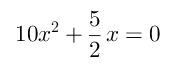

<!-- README.md is generated from README.Rmd. Please edit that file -->

[](https://lifecycle.r-lib.org/articles/stages.html#experimental)
<!-- badges: end -->

# ggtex

# Description

This is a tiny Python 3 script to translate from modified LaTeX math
mode to Geogebra code for text objects.

# Instalation

Simply download the file `ggtex.py` and, if necessary, make it
executable.

You need to have the [docopt module](https://github.com/docopt/docopt),
which can be installed with

    pip install docopt==0.6.2

# Usage

    Converts modified LaTeX math-mode code to Geogebra code.
    See http://github.com/fnaufel/ggtex for syntax and more info.

    Usage:
      ggtex.py FILE
      ggtex.py -h | --help
      ggtex.py -v | --version

    Arguments:
      FILE                File containing code to convert to Geogebra

    Options:
      -h, --help          Show this screen.
      -v, --version       Show version.

# Syntax

The file you pass to `ggtex` contains LaTeX math code with one extra
feature: you can *embed Geogebra commands that generate text* — e.g.,
values and definitions of Geogebra objects, fractions, formulae etc. —
using the `@` delimiter.

For example, if you pass `ggtex` a file `example.tex` containing

``` latex
\[
  @a@ x^2 + @FractionText(2.5)@ x = 0
\]
```

then `ggtex` will output a file `example.tex.ggtex` with contents

``` python
FormulaText(Simplify(
a + " x^2 + " + FractionText(2.5) + " x = 0"
))
```

If `a` is a number defined in your Geogebra session with value, say, 10,
then this code, when entered in the Geogebra input bar, will produce a
text object containing:



## Note

The file passed to `ggtex` must contain a *LaTeX math snippet*,
optionally surrounded by display math markers `\[` and `\]`, *not a
complete LaTeX document*.

*Everything in the snippet* will be interpreted by Geogebra in math
mode. If you want to display text along with the math, use `\text{}`.

# Useful Geogebra functions

The [Geogebra text command
reference](https://wiki.geogebra.org/en/Text_Commands) lists some pretty
powerful functions to produce text objects such as

-   Continued fractions

-   Fraction representations/approximations of real numbers: try
    `FractionText(pi)`

-   Numbers in scientific notation

-   Surd representations: try `SurdText(2.439230484541326)`

-   and more
